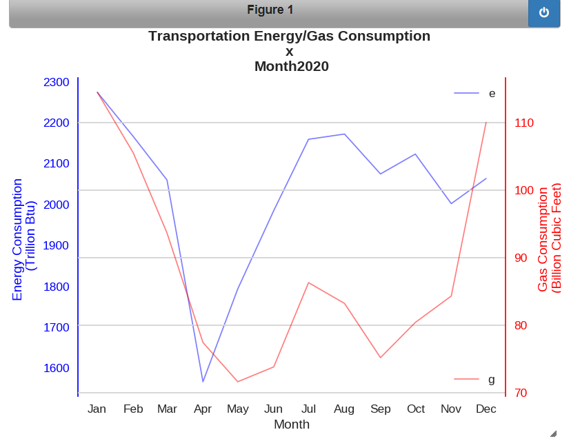
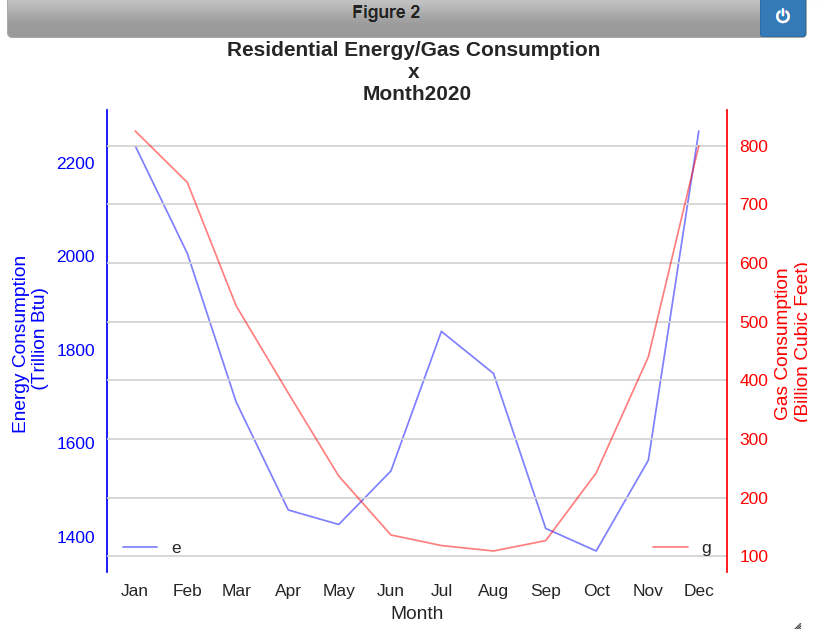
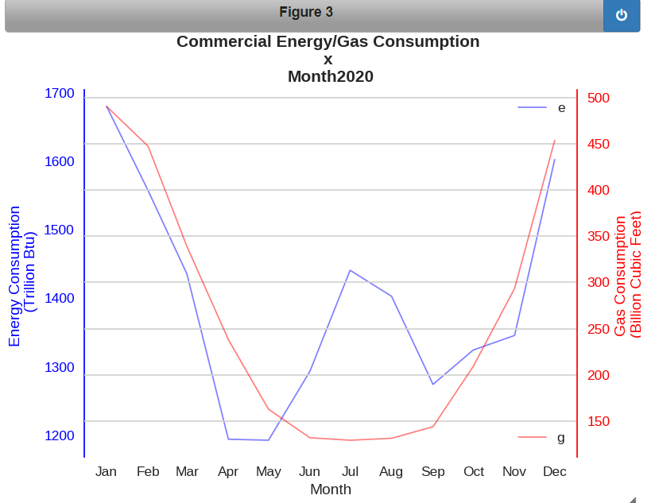
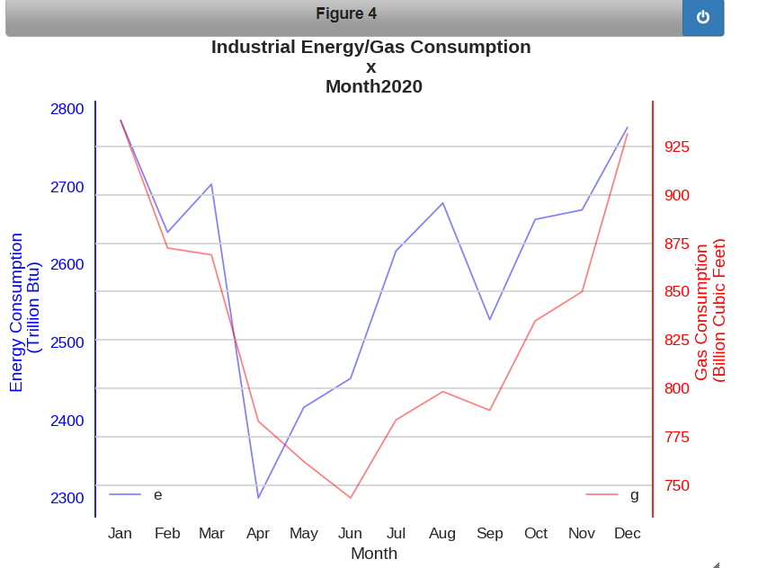
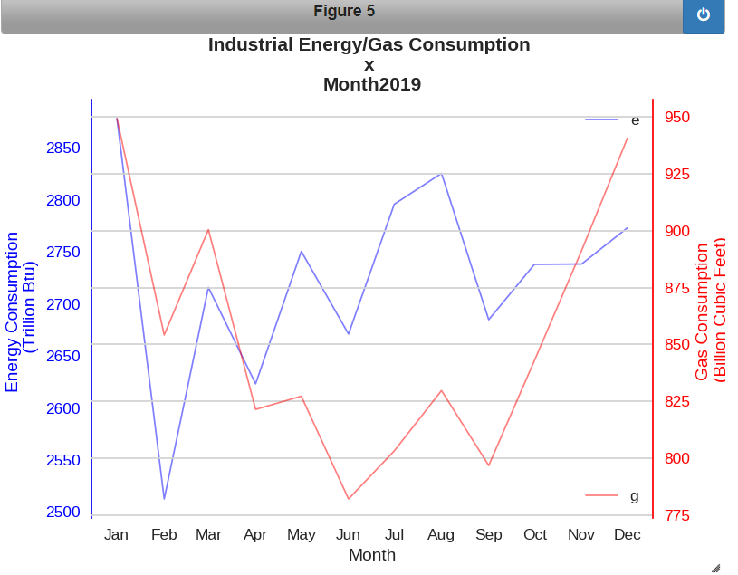
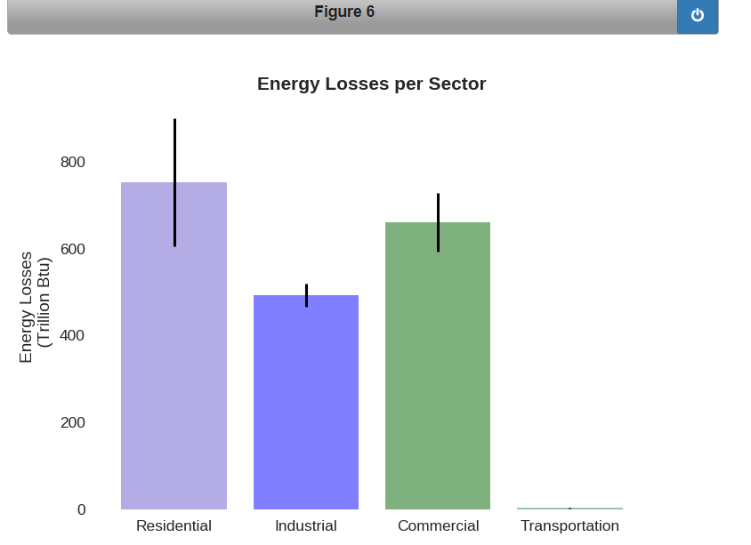
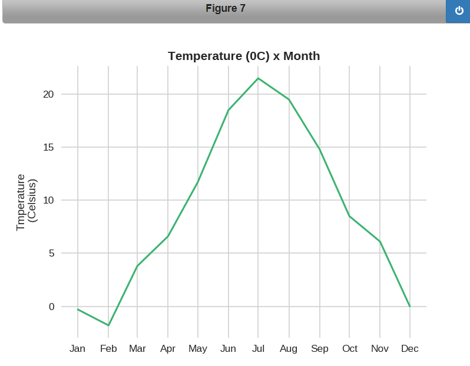

# Assignment 4

Before working on this assignment please read these instructions fully. In the submission area, you will notice that you can click the link to **Preview the Grading** for each step of the assignment. This is the criteria that will be used for peer grading. Please familiarize yourself with the criteria before beginning the assignment.

This assignment requires that you to find **at least** two datasets on the web which are related, and that you visualize these datasets to answer a question with the broad topic of **economic activity or measures** (see below) for the region of **Whitmore Lake, Michigan, United States**, or **United States** more broadly.

You can merge these datasets with data from different regions if you like! For instance, you might want to compare **Whitmore Lake, Michigan, United States** to Ann Arbor, USA. In that case at least one source file must be about **Whitmore Lake, Michigan, United States**.

You are welcome to choose datasets at your discretion, but keep in mind **they will be shared with your peers**, so choose appropriate datasets. Sensitive, confidential, illicit, and proprietary materials are not good choices for datasets for this assignment. You are welcome to upload datasets of your own as well, and link to them using a third party repository such as github, bitbucket, pastebin, etc. Please be aware of the Coursera terms of service with respect to intellectual property.

Also, you are welcome to preserve data in its original language, but for the purposes of grading you should provide english translations. You are welcome to provide multiple visuals in different languages if you would like!

As this assignment is for the whole course, you must incorporate principles discussed in the first week, such as having as high data-ink ratio (Tufte) and aligning with Cairo’s principles of truth, beauty, function, and insight.

Here are the assignment instructions:

 * State the region and the domain category that your data sets are about (e.g., **Whitmore Lake, Michigan, United States** and **economic activity or measures**).
 * You must state a question about the domain category and region that you identified as being interesting.
 * You must provide at least two links to available datasets. These could be links to files such as CSV or Excel files, or links to websites which might have data in tabular form, such as Wikipedia pages.
 * You must upload an image which addresses the research question you stated. In addition to addressing the question, this visual should follow Cairo's principles of truthfulness, functionality, beauty, and insightfulness.
 * You must contribute a short (1-2 paragraph) written justification of how your visualization addresses your stated research question.

What do we mean by **economic activity or measures**?  For this category you might look at the inputs or outputs to the given economy, or major changes in the economy compared to other regions.

## Tips
* Wikipedia is an excellent source of data, and I strongly encourage you to explore it for new data sources.
* Many governments run open data initiatives at the city, region, and country levels, and these are wonderful resources for localized data sources.
* Several international agencies, such as the [United Nations](http://data.un.org/), the [World Bank](http://data.worldbank.org/), the [Global Open Data Index](http://index.okfn.org/place/) are other great places to look for data.
* This assignment requires you to convert and clean datafiles. Check out the discussion forums for tips on how to do this from various sources, and share your successes with your fellow students!

## Example
Looking for an example? Here's what our course assistant put together for the **Ann Arbor, MI, USA** area using **sports and athletics** as the topic. [Example Solution File](./readonly/Assignment4_example.pdf)

## **1)    REGION AND DOMAIN**

State the region and the domain category of the data sets are about.


**City**:  Whitmore Lake
**State**: Michigan, United States

Energy Consumption per Sector and Weather

## ** 2) RESEARCH QUESTION - Hypotheses**

The energy aspects allows to follow the city growth. If the cities grows the energy consumption will grows as well.

There are lot of factors that could be crossed with energy which could result into increasing informations about some city in particular. For example, the weather, the size of the industrial market, the population size etc..

We can analyse based on the consumption behavior, the losses, the energy types...

It´s possible to do previsions based in the energy factor.

To prove my point here I will study a lot of characteristics from the energy perspective and try to find correlation with at least one aspect, the weather.


ENERGY:
-  55% of U.S. households use 2 types of fuel: eletricity + natural gas.
-  The other types of fuels: propane, wood, fuel oil.

- Based in the geography, climate conditions: Whitmore Lake energy consumption profile is similar to the Michigan State consumption profile.

- To estimate Whitmore Lake monthly consumption, it will be estimated based in Michigan consumption behavior proportionaly of the US monthly energy consumption.


#### HYPOTHESES:    CORRELATION: ENERGY & WEATHER

- find correlation between weather and energy consumption.
- the cold regions, annualy use more energy than the hot regions.


## ** 3) LINKS**

The datasets used are from the following sources:

    -https://www.eia.gov/
    -https://www.census.gov/
    -https://www.climate.gov/

It will be used the following datasets:

    -https://www.eia.gov/state/seds/seds-data-complete.php#Consumption
    -https://www.census.gov/quickfacts/fact/csv/whitmorelakecdpmichigan/BZA010220
    -https://www.ncei.noaa.gov/orders/cdo/3016771.csv


### **(a) IMPORTING DATA**


```python
#import re
import numpy as np
import pandas as pd
import matplotlib.pyplot as plt
import scipy.stats as st
import seaborn as sns
from matplotlib.cm import ScalarMappable
import matplotlib.cm
#import os.path

% matplotlib notebook


# Extracting Michigan energy consumption behavior - Whitmore Lake is a city inside the Michigan State.

# (1) Electric Power Sector Consumption Estimates, 2020 - Trillion Btu
EPSC = pd.read_excel('Electric Power Sector Consumption.xlsx', encoding = "unicode_escape", skiprows = 1)
# (2) Population, GDP, and Degree Days, Ranked by State, 2020
PGDPHC = pd.read_excel('Population GDP Heat Cold.xlsx', encoding = "unicode_escape")
# (3) Total Energy Consumption Estimates by End-Use Sector, Ranked by State, 2020
TECEU = pd.read_excel('Total Energy Consumption by End-User Sector .xlsx', encoding = "unicode_escape")
# (4) Total Energy Consumption Estimates per Capita by End-Use Sector, Ranked by State, 2020
TECperCapitaEU = pd.read_excel('Total Energy Consumption per Capita by End_Users.xlsx', encoding = "unicode_escape")
# (5) Census
Population = pd.read_csv('Census.csv', encoding = "unicode_escape")
# (6) Anual weather
Weather = pd.read_excel('Table Anual 2020 weather.xlsx', encoding = "unicode_escape", skiprows = 1 )


# Extracting USA energy consumption monthly behavior.

# (7) Energy_Consumption__Transportation_Sector_-_Total_End-Use_Sectors_-_and_Electric_Power_Sector
ECTSmonthly = pd.read_excel('Table_2.1b__Energy_Consumption__Transportation_Sector_-_Total_End-Use_Sectors_-_and_Electric_Power_Sector.xlsx'
                            , encoding = "unicode_escape", skiprows = 10)
# (8) Energy Consumption Residential-Commercial-and Industrial Sectors
ECRCImonthly = pd.read_excel('Table_2.1a__Energy_Consumption__Residential_-_Commercial_-_and_Industrial_Sectors (1).xlsx'
                            , encoding = "unicode_escape", skiprows = 10)
# (9) Natural Gas Consumption by Sector :
NGCS= pd.read_excel('Table_4.3_Natural_Gas_Consumption_by_Sector.xlsx', skiprows = 10, encoding = "unicode_escape")

# (10) State Space Heating Fuels.xlsx :
SSHF = pd.read_excel('State Space Heating Fuels.xlsx',skiprows = 4, encoding = "unicode_escape")

# (11) HC 6.6.xlsx
HC = pd.read_excel('HC 6.6.xlsx', skiprows = 1, encoding = "unicode_escape")

# (11)

# Exploring the data:
    #(a) EPSC:
#print(EPSC.head())
#print(EPSC.info())
#print(EPSC.columns)
#print(EPSC.shape)

    #(b) PGDPHC:
#print(PGDPHC.head())
#print(PGDPHC.info())
#print(PGDPHC.columns)
#print(PGDPHC.shape)

    #(c) TECEU:
#print(TECEU.head())
#print(TECEU.info())
#print(TECEU.columns)
#print(TECEU.shape)

    #(d) TECperCapitaEU:
#print(TECperCapitaEU.head())
#print(TECperCapitaEU.info())
#print(TECperCapitaEU.columns)
#print(TECperCapitaEU.shape)
#print(TECperCapitaEU.describe)

    #(e) Population:
#print(Population.head())
#print(Population.info())
#print(Population.columns)
#print(Population.shape)

    #(f) Weather:
#print(Weather.head())
#print(Weather.info())
#print(Weather.columns)
#print(Weather.shape)

    #(g) ECRCImonthly:
#print(ECRCImonthly.head())
#print(ECRCImonthly.info())
#print(ECRCImonthly.columns)
#print(ECRCImonthly.shape)

    #(h) ECTSmonthly:
#print(ECTSmonthly.head())
#print(ECTSmonthly.info())
#print(ECTSmonthly.columns)
#print(ECTSmonthly.shape)

 #(i) NGCS:
#print(NGCS.head())
#print(NGCS.info())
#print(NGCS.columns)
#print(NGCS.shape)

 #(j) SSHF:
#print(SSHF.head(30))
#print(SSHF.info())
#print(SSHF.columns)
#print(SSHF.shape)

 #(k) HC:
#print(HC)
#print(HC.info())
#print(HC.columns)
#print(HC.shape)

```

### **(b) STUDYING, PREPARING DATA**

#### **(b.1) THE WEATHER CHARACTERISTICS**

** 1) Extracting Michigan HDD (Heating Degree Days) and CDD (Cooling Degree Days) .**


```python
# Extracting Michigan row from Population, GDP, and Degree Days : here what is interesting is the HDD and CDD for the purpose
# of this study :

# Creating new df Heating Degree Days columns:
HDD = PGDPHC[['Heating Degree Days','Unnamed: 8']]
#print(HDD.head(20))

HDDM = HDD.iloc[16]
print(HDDM)


```

    Heating Degree Days    Michigan
    Unnamed: 8                 6282
    Name: 16, dtype: object


```python
# Creating new df Heating Degree Days columns:
CDD = PGDPHC[['Cooling Degree Days','Unnamed: 10']]
#print(CDD.head(50))

CDDM = CDD.iloc[38]
print(CDDM)

```

    Cooling Degree Days    Michigan
    Unnamed: 10                 699
    Name: 38, dtype: object


**2) Average Degree in Farenheit values per Month.**


```python
Jan = Weather[['Unnamed: 0','JAN']]
#print(Jan)

JanWL = Jan.iloc[181]
print(JanWL)
```

    Unnamed: 0    WHITMORE LAKE 1NW
    JAN                        29.4
    Name: 181, dtype: object


```python
Feb = Weather[['Unnamed: 0','FEB']]
#print(Feb)

FebWL = Feb.iloc[181]
print(FebWL)
```

    Unnamed: 0    WHITMORE LAKE 1NW
    FEB                        26.4
    Name: 181, dtype: object


```python
MarWL = Weather[['Unnamed: 0','MAR']].iloc[181]
print(MarWL)

AprWL = Weather[['Unnamed: 0','APR']].iloc[181]
print(AprWL)

MayWL = Weather[['Unnamed: 0','MAY']].iloc[181]
print(MayWL)

JunWL = Weather[['Unnamed: 0','JUN']].iloc[181]
print(JunWL)

JulWL = Weather[['Unnamed: 0','JUL']].iloc[181]
print(JulWL)

AugWL = Weather[['Unnamed: 0','AUG']].iloc[181]
print(AugWL)

SepWL = Weather[['Unnamed: 0','SEP']].iloc[181]
print(SepWL)

OctWL = Weather[['Unnamed: 0','OCT']].iloc[181]
print(OctWL)

NovWL = Weather[['Unnamed: 0','NOV']].iloc[181]
print(NovWL)

DecWL = Weather[['Unnamed: 0','DEC']].iloc[181]
print(DecWL)
```

    Unnamed: 0    WHITMORE LAKE 1NW
    MAR                       37.5M
    Name: 181, dtype: object
    Unnamed: 0    WHITMORE LAKE 1NW
    APR                        43.1
    Name: 181, dtype: object
    Unnamed: 0    WHITMORE LAKE 1NW
    MAY                       53.4M
    Name: 181, dtype: object
    Unnamed: 0    WHITMORE LAKE 1NW
    JUN                       66.9M
    Name: 181, dtype: object
    Unnamed: 0    WHITMORE LAKE 1NW
    JUL                       73.1M
    Name: 181, dtype: object
    Unnamed: 0    WHITMORE LAKE 1NW
    AUG                        69.0
    Name: 181, dtype: object
    Unnamed: 0    WHITMORE LAKE 1NW
    SEP                        59.6
    Name: 181, dtype: object
    Unnamed: 0    WHITMORE LAKE 1NW
    OCT                        47.0
    Name: 181, dtype: object
    Unnamed: 0    WHITMORE LAKE 1NW
    NOV                        42.2
    Name: 181, dtype: object
    Unnamed: 0    WHITMORE LAKE 1NW
    DEC                       30.0M
    Name: 181, dtype: object


The M together with the temperature value is only to ilustrate a comparative as maximum between other Michigan cities. In this case it will be removed.

**3) Converting temperatures values into Celsius.**


```python
Jan = float(JanWL.iloc[1])
Feb = float(FebWL.iloc[1])
Mar = float(MarWL.str.split().str[0].str.replace('M','').iloc[1])
Apr = float(AprWL.iloc[1])
May = float(MayWL.str.split().str[0].str.replace('M','').iloc[1])
Jun = float(JunWL.str.split().str[0].str.replace('M','').iloc[1])
Jul = float(JulWL.str.split().str[0].str.replace('M','').iloc[1])
Aug = float(AugWL.iloc[1])
Sep = float(SepWL.iloc[1])
Oct = float(OctWL.iloc[1])
Nov = float(NovWL.iloc[1])
Dec = float(DecWL.str.split().str[0].str.replace('M','').iloc[1])

print(Jan, Feb, Mar, Apr, May, Jun, Jul, Aug, Sep, Oct, Nov, Dec)
```

    29.4 26.4 37.5 43.1 53.4 66.9 73.1 69.0 59.6 47.0 42.2 30.0


```python
# Creating a list:
temperature = [Jan, Feb, Mar, Apr, May, Jun, Jul, Aug, Sep, Oct, Nov, Dec]
#print(temperature)

# Converting to Celsius:
tempC = [(x-30)/2 for x in temperature]
# Reducing the decimals:
temperatureCelsius = [round(T,1) for T in tempC]
print(temperatureCelsius)

```

    [-0.3, -1.8, 3.8, 6.6, 11.7, 18.5, 21.5, 19.5, 14.8, 8.5, 6.1, 0.0]


### **(b.2) Exlporing and Understanding Energy Consumption**

**Total Energy Consumption Estimates by End-Use Sector:**

    There are 4 different categories: residencial, industrial, transportation and commercial.
    Throught those divisions it´s possible to understand the representativity of each group in the Michigan State.

**1) Energy Types:**


```python
# Understanding the energy types used in Michigan State.

EPSC1 = EPSC.set_index('State')
#print(EPSC1)
EPSCM = EPSC1.loc['Michigan']
print(EPSCM)
```

    Coal                            303
    Natural Gas a                 317.7
    Distillate Fuel Oil               1
    Petroleum Coke                 10.4
    Residual Fuel Oil               0.1
    Total                          11.5
    Nuclear Electric Power        316.7
    Hydroelectric Power b            15
    Wood and Waste c               20.1
    Geothermal                        0
    Solar d                         1.4
    Wind                           59.1
    Electricity Net Imports e       5.8
    Total f                      1050.2
    Name: Michigan, dtype: object


**2) Energy Consumption per Sector:**


```python
# Exploiting in 04 different df: residential, commercial, industrial and transportation.

# Residential:
EnergyResidential = TECEU[['Residential', 'Unnamed: 1']]
#print(EnergyResidential.head(20))

EnergyResidentialM = EnergyResidential.iloc[8]
print(EnergyResidentialM)

```

    Residential    Michigan
    Unnamed: 1        770.5
    Name: 8, dtype: object


```python
# Commercial:

EnergyCommercial = TECEU[['Commercial', 'Unnamed: 3']]
#print(EnergyCommercial.head(20))

EnergyCommercialM = EnergyCommercial.iloc[8]
print(EnergyCommercialM)
```

    Commercial    Michigan
    Unnamed: 3         571
    Name: 8, dtype: object


```python
# Industrial:

EnergyIndustrial = TECEU[['Industrial', 'Unnamed: 5']]
#print(EnergyIndustrial.head(20))

EnergyIndustrialM = EnergyIndustrial.iloc[12]
print(EnergyIndustrialM)
```

    Industrial    Michigan
    Unnamed: 5       619.6
    Name: 12, dtype: object


```python
# Transportation:

EnergyTransportation = TECEU[['Transportation', 'Unnamed: 7']]
#print(EnergyTransportation.head(20))

EnergyTransportationM = EnergyTransportation.iloc[11]
print(EnergyTransportationM)

```

    Transportation    Michigan
    Unnamed: 7           649.5
    Name: 11, dtype: object


```python
# Total Energy Consumption Michigan:

EnergyTotal = TECEU[['Total', 'Unnamed: 9']]
#print(EnergyTotal.head(20))

EnergyTotalM = EnergyTotal.iloc[10]
print(EnergyTotalM)
```

    Total         Michigan
    Unnamed: 9      2610.6
    Name: 10, dtype: object


**The number values obtained above are in Trillion Btu.**

Dividing the captured energy values per transport, residence, industrial and commercial per the total of energy consumption we can observe that Michigan have almost an equilibre between the 4 sectors:
- Residential: ~29,51% ;
- Commercial: ~21,87% ;
- Transportation: ~24,87% ;
- Industrial: ~23,73% .

**Whitmore Lake** : The largest industries in Whitmore Lake, MI are Health Care & Social Assistance (596 people), Manufacturing (436 people), and Construction (410 people). (ref.:https://datausa.io/profile/geo/whitmore-lake-mi#economy)

The energy consumption data available are usually per state, we can use Michigan energy consumption data to study the Whitmore Lake behavior, as follows.

**3) Michigan Energy consumption per capita**


```python
Mpercapita = TECperCapitaEU[['Residential', 'Unnamed: 2']]
#print(Mpercapita)

MperCapitaR = Mpercapita.iloc[8]
print(MperCapitaR)

MpcR = Mpercapita.iloc[8,1]
print(MpcR)

MpcRi = int(MpcR)
```

    Residential    Michigan
    Unnamed: 2         76.5
    Name: 8, dtype: object
    76.5


```python
MTpercapita = TECperCapitaEU[['Total', 'Unnamed: 10']]
#print(MTpercapita)

MperCapitaT = MTpercapita.iloc[31]
print(MperCapitaT)

MpcT = MTpercapita.iloc[31,1]
print(MpcT)

# Converting value into integer:

MpcTi = int(MpcT)

```

    Total          Michigan
    Unnamed: 10       259.3
    Name: 31, dtype: object
    259.3


**4) Energy Conumption per Month - 2020**


```python
# Residential Sector:

ECRmonthly = ECRCImonthly[['Month','End-Use Energy Consumed by the Residential Sector',
       'Residential Sector Electrical System Energy Losses',
       'Total Energy Consumed by the Residential Sector',]]

#ECRmonthly

ECRmonth2020 = ECRmonthly.iloc[565:577]
ECRmonth2020
```


<div>
<table border="1" class="dataframe">
  <thead>
    <tr style="text-align: right;">
      <th></th>
      <th>Month</th>
      <th>End-Use Energy Consumed by the Residential Sector</th>
      <th>Residential Sector Electrical System Energy Losses</th>
      <th>Total Energy Consumed by the Residential Sector</th>
    </tr>
  </thead>
  <tbody>
    <tr>
      <th>565</th>
      <td>2020-01-01</td>
      <td>1467.75</td>
      <td>768.438</td>
      <td>2236.19</td>
    </tr>
    <tr>
      <th>566</th>
      <td>2020-02-01</td>
      <td>1317.04</td>
      <td>688.876</td>
      <td>2005.92</td>
    </tr>
    <tr>
      <th>567</th>
      <td>2020-03-01</td>
      <td>1061.51</td>
      <td>626.821</td>
      <td>1688.33</td>
    </tr>
    <tr>
      <th>568</th>
      <td>2020-04-01</td>
      <td>871.417</td>
      <td>585.573</td>
      <td>1456.99</td>
    </tr>
    <tr>
      <th>569</th>
      <td>2020-05-01</td>
      <td>744.642</td>
      <td>681.409</td>
      <td>1426.05</td>
    </tr>
    <tr>
      <th>570</th>
      <td>2020-06-01</td>
      <td>701.112</td>
      <td>839.408</td>
      <td>1540.52</td>
    </tr>
    <tr>
      <th>571</th>
      <td>2020-07-01</td>
      <td>796.212</td>
      <td>1042.97</td>
      <td>1839.18</td>
    </tr>
    <tr>
      <th>572</th>
      <td>2020-08-01</td>
      <td>756.389</td>
      <td>992.611</td>
      <td>1749</td>
    </tr>
    <tr>
      <th>573</th>
      <td>2020-09-01</td>
      <td>677.617</td>
      <td>739.938</td>
      <td>1417.56</td>
    </tr>
    <tr>
      <th>574</th>
      <td>2020-10-01</td>
      <td>739.31</td>
      <td>629.965</td>
      <td>1369.28</td>
    </tr>
    <tr>
      <th>575</th>
      <td>2020-11-01</td>
      <td>939.025</td>
      <td>624.563</td>
      <td>1563.59</td>
    </tr>
    <tr>
      <th>576</th>
      <td>2020-12-01</td>
      <td>1452.15</td>
      <td>815.708</td>
      <td>2267.86</td>
    </tr>
  </tbody>
</table>
</div>


```python
# Industrial:
ECImonthly = ECRCImonthly[['Month','End-Use Energy Consumed by the Industrial Sector',
       'Industrial Sector Electrical System Energy Losses',
       'Total Energy Consumed by the Industrial Sector']]
#ECImonthly

ECImonth2020 = ECImonthly.iloc[565:577]
ECImonth2020
```


<div>
<table border="1" class="dataframe">
  <thead>
    <tr style="text-align: right;">
      <th></th>
      <th>Month</th>
      <th>End-Use Energy Consumed by the Industrial Sector</th>
      <th>Industrial Sector Electrical System Energy Losses</th>
      <th>Total Energy Consumed by the Industrial Sector</th>
    </tr>
  </thead>
  <tbody>
    <tr>
      <th>565</th>
      <td>2020-01-01</td>
      <td>2287.33</td>
      <td>497.762</td>
      <td>2785.1</td>
    </tr>
    <tr>
      <th>566</th>
      <td>2020-02-01</td>
      <td>2156.64</td>
      <td>484.773</td>
      <td>2641.42</td>
    </tr>
    <tr>
      <th>567</th>
      <td>2020-03-01</td>
      <td>2216.59</td>
      <td>486.586</td>
      <td>2703.17</td>
    </tr>
    <tr>
      <th>568</th>
      <td>2020-04-01</td>
      <td>1864.23</td>
      <td>436.015</td>
      <td>2300.24</td>
    </tr>
    <tr>
      <th>569</th>
      <td>2020-05-01</td>
      <td>1937.5</td>
      <td>478.897</td>
      <td>2416.4</td>
    </tr>
    <tr>
      <th>570</th>
      <td>2020-06-01</td>
      <td>1953.2</td>
      <td>500.593</td>
      <td>2453.79</td>
    </tr>
    <tr>
      <th>571</th>
      <td>2020-07-01</td>
      <td>2088.44</td>
      <td>528.999</td>
      <td>2617.44</td>
    </tr>
    <tr>
      <th>572</th>
      <td>2020-08-01</td>
      <td>2139.62</td>
      <td>539.376</td>
      <td>2679</td>
    </tr>
    <tr>
      <th>573</th>
      <td>2020-09-01</td>
      <td>2060.5</td>
      <td>468.753</td>
      <td>2529.25</td>
    </tr>
    <tr>
      <th>574</th>
      <td>2020-10-01</td>
      <td>2166.16</td>
      <td>491.794</td>
      <td>2657.95</td>
    </tr>
    <tr>
      <th>575</th>
      <td>2020-11-01</td>
      <td>2174.04</td>
      <td>496.129</td>
      <td>2670.17</td>
    </tr>
    <tr>
      <th>576</th>
      <td>2020-12-01</td>
      <td>2276.51</td>
      <td>499.705</td>
      <td>2776.22</td>
    </tr>
  </tbody>
</table>
</div>


```python
# Commercial:
ECCmonthly = ECRCImonthly[['Month','End-Use Energy Consumed by the Commercial Sector',
       'Commercial Sector Electrical System Energy Losses',
       'Total Energy Consumed by the Commercial Sector']]
#ECImonthly

ECCmonth2020 = ECCmonthly.iloc[565:577]
ECCmonth2020
```


<div>
<table border="1" class="dataframe">
  <thead>
    <tr style="text-align: right;">
      <th></th>
      <th>Month</th>
      <th>End-Use Energy Consumed by the Commercial Sector</th>
      <th>Commercial Sector Electrical System Energy Losses</th>
      <th>Total Energy Consumed by the Commercial Sector</th>
    </tr>
  </thead>
  <tbody>
    <tr>
      <th>565</th>
      <td>2020-01-01</td>
      <td>1001.99</td>
      <td>678.097</td>
      <td>1680.08</td>
    </tr>
    <tr>
      <th>566</th>
      <td>2020-02-01</td>
      <td>924.343</td>
      <td>632.916</td>
      <td>1557.26</td>
    </tr>
    <tr>
      <th>567</th>
      <td>2020-03-01</td>
      <td>809.751</td>
      <td>625.949</td>
      <td>1435.7</td>
    </tr>
    <tr>
      <th>568</th>
      <td>2020-04-01</td>
      <td>646.859</td>
      <td>547.516</td>
      <td>1194.38</td>
    </tr>
    <tr>
      <th>569</th>
      <td>2020-05-01</td>
      <td>584.909</td>
      <td>608.022</td>
      <td>1192.93</td>
    </tr>
    <tr>
      <th>570</th>
      <td>2020-06-01</td>
      <td>594.272</td>
      <td>699.364</td>
      <td>1293.64</td>
    </tr>
    <tr>
      <th>571</th>
      <td>2020-07-01</td>
      <td>647.67</td>
      <td>793.311</td>
      <td>1440.98</td>
    </tr>
    <tr>
      <th>572</th>
      <td>2020-08-01</td>
      <td>634.56</td>
      <td>768.518</td>
      <td>1403.08</td>
    </tr>
    <tr>
      <th>573</th>
      <td>2020-09-01</td>
      <td>619.025</td>
      <td>655.398</td>
      <td>1274.42</td>
    </tr>
    <tr>
      <th>574</th>
      <td>2020-10-01</td>
      <td>676.905</td>
      <td>647.604</td>
      <td>1324.51</td>
    </tr>
    <tr>
      <th>575</th>
      <td>2020-11-01</td>
      <td>732.366</td>
      <td>613.506</td>
      <td>1345.87</td>
    </tr>
    <tr>
      <th>576</th>
      <td>2020-12-01</td>
      <td>939.736</td>
      <td>662.923</td>
      <td>1602.66</td>
    </tr>
  </tbody>
</table>
</div>


```python
# Transportation:

ECTmonthly = ECTSmonthly[['Month','End-Use Energy Consumed by the Transportation Sector',
       'Electrical Energy System Losses Proportioned to the Transportation Sector',
       'Total Energy Consumed by the Transportation Sector' ]]

#ECTmonthly

ECTmonth2020 = ECTmonthly.iloc[565:577]
ECTmonth2020
```


<div>
<table border="1" class="dataframe">
  <thead>
    <tr style="text-align: right;">
      <th></th>
      <th>Month</th>
      <th>End-Use Energy Consumed by the Transportation Sector</th>
      <th>Electrical Energy System Losses Proportioned to the Transportation Sector</th>
      <th>Total Energy Consumed by the Transportation Sector</th>
    </tr>
  </thead>
  <tbody>
    <tr>
      <th>565</th>
      <td>2020-01-01</td>
      <td>2270.11</td>
      <td>4.136</td>
      <td>2274.25</td>
    </tr>
    <tr>
      <th>566</th>
      <td>2020-02-01</td>
      <td>2162.31</td>
      <td>3.803</td>
      <td>2166.12</td>
    </tr>
    <tr>
      <th>567</th>
      <td>2020-03-01</td>
      <td>2056.41</td>
      <td>3.598</td>
      <td>2060.01</td>
    </tr>
    <tr>
      <th>568</th>
      <td>2020-04-01</td>
      <td>1564.1</td>
      <td>2.662</td>
      <td>1566.77</td>
    </tr>
    <tr>
      <th>569</th>
      <td>2020-05-01</td>
      <td>1790.8</td>
      <td>2.927</td>
      <td>1793.73</td>
    </tr>
    <tr>
      <th>570</th>
      <td>2020-06-01</td>
      <td>1982.07</td>
      <td>3.065</td>
      <td>1985.14</td>
    </tr>
    <tr>
      <th>571</th>
      <td>2020-07-01</td>
      <td>2156</td>
      <td>3.47</td>
      <td>2159.47</td>
    </tr>
    <tr>
      <th>572</th>
      <td>2020-08-01</td>
      <td>2169.07</td>
      <td>3.262</td>
      <td>2172.33</td>
    </tr>
    <tr>
      <th>573</th>
      <td>2020-09-01</td>
      <td>2071.66</td>
      <td>3.091</td>
      <td>2074.75</td>
    </tr>
    <tr>
      <th>574</th>
      <td>2020-10-01</td>
      <td>2120.24</td>
      <td>3.123</td>
      <td>2123.37</td>
    </tr>
    <tr>
      <th>575</th>
      <td>2020-11-01</td>
      <td>1998.89</td>
      <td>3.289</td>
      <td>2002.18</td>
    </tr>
    <tr>
      <th>576</th>
      <td>2020-12-01</td>
      <td>2059.67</td>
      <td>3.907</td>
      <td>2063.58</td>
    </tr>
  </tbody>
</table>
</div>


** 5) Natural Gas Consumption**


```python
# Residential Natural Gas Consumption - 2020

NGCR = NGCS[['Month','Natural Gas Consumed by the Residential Sector']]
#print(NGCR)

NGCR2020 = NGCR.iloc[565:577]
print(NGCR2020)
```

             Month Natural Gas Consumed by the Residential Sector
    565 2020-01-01                                        824.836
    566 2020-02-01                                        737.107
    567 2020-03-01                                        526.809
    568 2020-04-01                                        378.049
    569 2020-05-01                                        236.578
    570 2020-06-01                                        136.117
    571 2020-07-01                                        118.132
    572 2020-08-01                                        108.819
    573 2020-09-01                                        126.524
    574 2020-10-01                                        241.924
    575 2020-11-01                                        439.827
    576 2020-12-01                                        799.589


```python
# Commercial Natural Gas Consumption - 2020

NGCC = NGCS[['Month','Natural Gas Consumed by the Commercial Sector']]
#print(NGCR)

NGCC2020 = NGCC.iloc[565:577]
print(NGCC2020)
```

             Month Natural Gas Consumed by the Commercial Sector
    565 2020-01-01                                       490.676
    566 2020-02-01                                       447.569
    567 2020-03-01                                       339.081
    568 2020-04-01                                       238.102
    569 2020-05-01                                       162.665
    570 2020-06-01                                       131.787
    571 2020-07-01                                       129.086
    572 2020-08-01                                       131.179
    573 2020-09-01                                       143.703
    574 2020-10-01                                        208.85
    575 2020-11-01                                       293.558
    576 2020-12-01                                       453.966


```python
# Industrial Natural Gas Consumption - 2020

NGCI = NGCS[['Month','Natural Gas Consumed by the Industrial Sector, Total']]
#print(NGCR)

NGCI2020 = NGCI.iloc[565:577]
print(NGCI2020)
```

             Month Natural Gas Consumed by the Industrial Sector, Total
    565 2020-01-01                                            938.452
    566 2020-02-01                                            872.522
    567 2020-03-01                                            869.004
    568 2020-04-01                                            783.003
    569 2020-05-01                                            762.198
    570 2020-06-01                                            743.352
    571 2020-07-01                                            783.665
    572 2020-08-01                                            798.309
    573 2020-09-01                                             788.65
    574 2020-10-01                                            834.819
    575 2020-11-01                                            849.919
    576 2020-12-01                                            931.562


```python
# Transportation Natuarl Gas Consumption - 2020

NGCT = NGCS[['Month','Natural Gas Consumed by the Transportation Sector, Total']]
#print(NGCR)

NGCT2020 = NGCT.iloc[565:577]
print(NGCT2020)

```

             Month Natural Gas Consumed by the Transportation Sector, Total
    565 2020-01-01                                            114.491
    566 2020-02-01                                            105.515
    567 2020-03-01                                             93.679
    568 2020-04-01                                             77.464
    569 2020-05-01                                             71.652
    570 2020-06-01                                             73.848
    571 2020-07-01                                             86.321
    572 2020-08-01                                             83.247
    573 2020-09-01                                             75.216
    574 2020-10-01                                             80.426
    575 2020-11-01                                             84.339
    576 2020-12-01                                             110.04


#### **(b.3) Census: Whitmore Lake population - 2020.**


```python
populationWL = Population [['Fact','Whitmore Lake CDP, Michigan']]
#print(populationWL.head())

popWL = populationWL.iloc[3]
print(popWL)
#print(type(popWL))

# Converting value into integer:

popWL1 = popWL.str.split().str[0].str.replace(',','')
#print(popWL1)

pop = popWL1.iloc[1]
#print(type(pop))
#print(pop)

popi = int(pop)
print(popi)


```

    Fact                           Population, Census, April 1, 2020
    Whitmore Lake CDP, Michigan                                7,584
    Name: 3, dtype: object
    7584


#### ** 1) Calculating the energy consumption in Whitmore Lake based in the population and the Michigan per capita and residential consumption.**


```python
# Coverting to int values: Total.

# Total energy per Whitmore Lake city consumption: million Btu per year.

TCWL = popi * MpcTi
TCWL
```


    1964256


```python
# Converting the residential values :

# Residential Energy per capita Whitmore Lake: million Btu per year.

MpcWL = MpcRi * popi
MpcWL
```


    576384


### ** (d) VISUALIZING DATA**


```python
# Preparing data to plot - TRANSPORTATION

# Transportation Gas Consumption 2020

GT = NGCT2020['Natural Gas Consumed by the Transportation Sector, Total'].iloc[0:13]
GT1 = np.array(GT)
print(GT1)

# Transportation Energy Consumption 2020

ET = ECTmonth2020['Total Energy Consumed by the Transportation Sector'].iloc[0:13]
ET = np.array(ET)

```

    [114.491 105.515 93.679 77.464 71.652 73.848 86.321 83.247 75.216 80.426
     84.339 110.04]


**(d.1) LINE GRAPHS **


```python
fig, ax  = plt.subplots()
ax = plt.axes()
# Setting ticks:

# x ticks 2020
xticks = (pd.date_range('1/1/2020','31/12/2020', freq = 'M') -1 + pd.Timedelta('1D')).strftime('%-j').astype(int)
xticks

xticks_labels = pd.to_datetime(xticks, format = '%j').strftime('%b')
xticks_labels

plt.xticks(xticks,xticks_labels)
plt.tick_params(left=False,bottom=False)

# Transportation Energy Consumption per Month 2020 - Michigan

ax.set( xlim=(0,365),xlabel='Month')
plt.title('Transportation Energy/Gas Consumption \nx \nMonth2020', fontweight="bold")

energyT = ax.plot(xticks, ET, c='b',alpha = 0.5, linewidth=1)
ax.set(ylabel='Energy Consumption \n (Trillion Btu)')
ax1 = ax.twinx()
gas = ax1.plot(xticks, GT1, c='r',alpha = 0.5, linewidth=1)
ax1.set(ylabel='Gas Consumption \n(Billion Cubic Feet)')

# Coloring ylabel ax
ax.yaxis.label.set_color('blue')
ax.tick_params(axis='y',colors='blue')
ax.spines['left'].set_color('blue')
ax.spines['left'].set_linewidth(1)


# Coloring ylabel ax1
ax1.yaxis.label.set_color('red')
ax1.tick_params(colors='red')
ax1.spines['right'].set_color('red')
ax1.spines['right'].set_linewidth(1)

plt.grid(True, color='lightgray')
ax.set_facecolor('white')

# Setting Legend
ax.legend('energy')
ax1.legend('gas', loc='lower right')
```


    <IPython.core.display.Javascript object>




    <matplotlib.legend.Legend at 0x7ff9592a3780>


```python
# Preparing data to plot -RESIDENTIAL

# Residential Gas Consumption 2020

GR = NGCR2020['Natural Gas Consumed by the Residential Sector'].iloc[0:13]
GR1 = np.array(GR)
print(GR1)

# Residential Energy Consumption 2020

ER = ECRmonth2020['Total Energy Consumed by the Residential Sector'].iloc[0:13]
ER = np.array(ER)
ER
```

    [824.836 737.107 526.809 378.049 236.578 136.117 118.132 108.819 126.524
     241.924 439.827 799.589]


    array([2236.192, 2005.918, 1688.328, 1456.989, 1426.051, 1540.519,
           1839.178, 1749, 1417.555, 1369.276, 1563.589, 2267.86], dtype=object)


```python
fig, ax  = plt.subplots()
ax = plt.axes()
# Setting ticks:

# x ticks 2020
xticks = (pd.date_range('1/1/2020','31/12/2020', freq = 'M') -1 + pd.Timedelta('1D')).strftime('%-j').astype(int)
xticks

xticks_labels = pd.to_datetime(xticks, format = '%j').strftime('%b')
xticks_labels

plt.xticks(xticks,xticks_labels)
plt.tick_params(left=False,bottom=False)

# Residential Energy Consumption per Month 2020 - Michigan

ax.set( xlim=(0,365),xlabel='Month')
plt.title('Residential Energy/Gas Consumption \nx \nMonth2020', fontweight="bold")

energyR = ax.plot(xticks, ER, c='b',alpha = 0.5, linewidth=1)
ax.set(ylabel='Energy Consumption \n (Trillion Btu)')
ax1 = ax.twinx()
gas = ax1.plot(xticks, GR1, c='r',alpha = 0.5, linewidth=1)
ax1.set(ylabel='Gas Consumption \n(Billion Cubic Feet)')

# Coloring ylabel ax
ax.yaxis.label.set_color('blue')
ax.tick_params(axis='y',colors='blue')
ax.spines['left'].set_color('blue')
ax.spines['left'].set_linewidth(1)


# Coloring ylabel ax1
ax1.yaxis.label.set_color('red')
ax1.tick_params(colors='red')
ax1.spines['right'].set_color('red')
ax1.spines['right'].set_linewidth(1)

plt.grid(True, color='lightgray')
ax.set_facecolor('white')

# Setting Legend
ax.legend('energy')
ax1.legend('gas', loc='lower right')
```


    <IPython.core.display.Javascript object>




    <matplotlib.legend.Legend at 0x7ff979f21dd8>


```python
# Preparing data to plot - Commercial

# Commercial Gas Consumption 2020

GC = NGCC2020['Natural Gas Consumed by the Commercial Sector'].iloc[0:13]
GC1 = np.array(GC)
print(GC1)

# Commercial Energy Consumption 2020

EC = ECCmonth2020['Total Energy Consumed by the Commercial Sector'].iloc[0:13]
EC = np.array(EC)
EC
```

    [490.676 447.569 339.081 238.102 162.665 131.787 129.086 131.179 143.703
     208.85 293.558 453.966]


    array([1680.084, 1557.259, 1435.7, 1194.375, 1192.931, 1293.636, 1440.981,
           1403.078, 1274.424, 1324.509, 1345.873, 1602.659], dtype=object)


```python
fig, ax  = plt.subplots()
ax = plt.axes()
# Setting ticks:

# x ticks 2020
xticks = (pd.date_range('1/1/2020','31/12/2020', freq = 'M') -1 + pd.Timedelta('1D')).strftime('%-j').astype(int)
xticks

xticks_labels = pd.to_datetime(xticks, format = '%j').strftime('%b')
xticks_labels

plt.xticks(xticks,xticks_labels)
plt.tick_params(left=False,bottom=False)

# Commercial Energy Consumption per Month 2020 - Michigan

ax.set( xlim=(0,365),xlabel='Month')
plt.title('Commercial Energy/Gas Consumption \nx \nMonth2020', fontweight="bold")

energyC = ax.plot(xticks, EC, c='b',alpha = 0.5, linewidth=1)
ax.set(ylabel='Energy Consumption \n (Trillion Btu)')
ax1 = ax.twinx()
gas = ax1.plot(xticks, GC1, c='r',alpha = 0.5, linewidth=1)
ax1.set(ylabel='Gas Consumption \n(Billion Cubic Feet)')

# Coloring ylabel ax
ax.yaxis.label.set_color('blue')
ax.tick_params(axis='y',colors='blue')
ax.spines['left'].set_color('blue')
ax.spines['left'].set_linewidth(1)


# Coloring ylabel ax1
ax1.yaxis.label.set_color('red')
ax1.tick_params(colors='red')
ax1.spines['right'].set_color('red')
ax1.spines['right'].set_linewidth(1)

plt.grid(True, color='lightgray')
ax.set_facecolor('white')

# Setting Legend
ax.legend('energy')
ax1.legend('gas', loc='lower right')
```


    <IPython.core.display.Javascript object>




    <matplotlib.legend.Legend at 0x7ff979d6b400>


```python
# Preparing data to plot - Industrial

# Industrial Gas Consumption 2020

GI = NGCI2020['Natural Gas Consumed by the Industrial Sector, Total'].iloc[0:13]
GI1 = np.array(GI)
print(GI1)

# Industrial Energy Consumption 2020

EI = ECImonth2020['Total Energy Consumed by the Industrial Sector'].iloc[0:13]
EI = np.array(EI)
EI
```

    [938.452 872.522 869.004 783.003 762.198 743.352 783.665 798.309 788.65
     834.819 849.919 931.562]


    array([2785.097, 2641.417, 2703.171, 2300.243, 2416.399, 2453.792,
           2617.437, 2679, 2529.249, 2657.955, 2670.168, 2776.215], dtype=object)


```python
fig, ax  = plt.subplots()
ax = plt.axes()
# Setting ticks:

# x ticks 2020
xticks = (pd.date_range('1/1/2020','31/12/2020', freq = 'M') -1 + pd.Timedelta('1D')).strftime('%-j').astype(int)
xticks

xticks_labels = pd.to_datetime(xticks, format = '%j').strftime('%b')
xticks_labels

plt.xticks(xticks,xticks_labels)
plt.tick_params(left=False,bottom=False)

# Industrial Energy Consumption per Month 2020 - Michigan

ax.set( xlim=(0,365),xlabel='Month')
plt.title('Industrial Energy/Gas Consumption \nx \nMonth2020', fontweight="bold")

energyC = ax.plot(xticks, EI, c='b',alpha = 0.5, linewidth=1)
ax.set(ylabel='Energy Consumption \n (Trillion Btu)')
ax1 = ax.twinx()
gas = ax1.plot(xticks, GI1, c='r',alpha = 0.5, linewidth=1)
ax1.set(ylabel='Gas Consumption \n(Billion Cubic Feet)')

# Coloring ylabel ax
ax.yaxis.label.set_color('blue')
ax.tick_params(axis='y',colors='blue')
ax.spines['left'].set_color('blue')
ax.spines['left'].set_linewidth(1)


# Coloring ylabel ax1
ax1.yaxis.label.set_color('red')
ax1.tick_params(colors='red')
ax1.spines['right'].set_color('red')
ax1.spines['right'].set_linewidth(1)

plt.grid(True, color='lightgray')
ax.set_facecolor('white')

# Setting Legend
ax.legend('energy')
ax1.legend('gas', loc='lower right')
```


    <IPython.core.display.Javascript object>




    <matplotlib.legend.Legend at 0x7ff979c2dac8>


#### **Industrial Sector 2019 - before Pandemic**


```python
NGCI2 = NGCS[['Month','Natural Gas Consumed by the Industrial Sector, Total']]
#print(NGCI2)

NGCI2019 = NGCI2.iloc[553:565]
print(NGCI2019)
```

             Month Natural Gas Consumed by the Industrial Sector, Total
    553 2019-01-01                                            949.375
    554 2019-02-01                                            854.179
    555 2019-03-01                                            900.547
    556 2019-04-01                                             821.44
    557 2019-05-01                                            827.253
    558 2019-06-01                                            782.059
    559 2019-07-01                                            803.191
    560 2019-08-01                                            829.744
    561 2019-09-01                                            796.782
    562 2019-10-01                                            842.939
    563 2019-11-01                                            891.366
    564 2019-12-01                                            940.724


```python
# Industrial:
ECImonthly2 = ECRCImonthly[['Month','End-Use Energy Consumed by the Industrial Sector',
       'Industrial Sector Electrical System Energy Losses',
       'Total Energy Consumed by the Industrial Sector']]
#ECImonthly

ECImonth2019 = ECImonthly2.iloc[553:565]
ECImonth2019
```


<div>
<table border="1" class="dataframe">
  <thead>
    <tr style="text-align: right;">
      <th></th>
      <th>Month</th>
      <th>End-Use Energy Consumed by the Industrial Sector</th>
      <th>Industrial Sector Electrical System Energy Losses</th>
      <th>Total Energy Consumed by the Industrial Sector</th>
    </tr>
  </thead>
  <tbody>
    <tr>
      <th>553</th>
      <td>2019-01-01</td>
      <td>2340.87</td>
      <td>537.116</td>
      <td>2877.98</td>
    </tr>
    <tr>
      <th>554</th>
      <td>2019-02-01</td>
      <td>2038.39</td>
      <td>474.199</td>
      <td>2512.59</td>
    </tr>
    <tr>
      <th>555</th>
      <td>2019-03-01</td>
      <td>2202.73</td>
      <td>513.105</td>
      <td>2715.83</td>
    </tr>
    <tr>
      <th>556</th>
      <td>2019-04-01</td>
      <td>2117.7</td>
      <td>505.53</td>
      <td>2623.22</td>
    </tr>
    <tr>
      <th>557</th>
      <td>2019-05-01</td>
      <td>2191.39</td>
      <td>559.044</td>
      <td>2750.43</td>
    </tr>
    <tr>
      <th>558</th>
      <td>2019-06-01</td>
      <td>2122.21</td>
      <td>548.832</td>
      <td>2671.04</td>
    </tr>
    <tr>
      <th>559</th>
      <td>2019-07-01</td>
      <td>2218.06</td>
      <td>577.675</td>
      <td>2795.74</td>
    </tr>
    <tr>
      <th>560</th>
      <td>2019-08-01</td>
      <td>2258.03</td>
      <td>567.322</td>
      <td>2825.35</td>
    </tr>
    <tr>
      <th>561</th>
      <td>2019-09-01</td>
      <td>2164.86</td>
      <td>519.937</td>
      <td>2684.8</td>
    </tr>
    <tr>
      <th>562</th>
      <td>2019-10-01</td>
      <td>2245.95</td>
      <td>492.007</td>
      <td>2737.96</td>
    </tr>
    <tr>
      <th>563</th>
      <td>2019-11-01</td>
      <td>2223.81</td>
      <td>514.488</td>
      <td>2738.3</td>
    </tr>
    <tr>
      <th>564</th>
      <td>2019-12-01</td>
      <td>2269.16</td>
      <td>503.855</td>
      <td>2773.01</td>
    </tr>
  </tbody>
</table>
</div>


```python
          # Preparing data to plot - Industrial

# Industrial Gas Consumption 2019

GI19 = NGCI2019['Natural Gas Consumed by the Industrial Sector, Total'].iloc[0:13]
GI2 = np.array(GI19)
print(GI2)

# Industrial Energy Consumption 2019

EI19 = ECImonth2019['Total Energy Consumed by the Industrial Sector'].iloc[0:13]
EI19 = np.array(EI19)
EI19
```

    [949.375 854.179 900.547 821.44 827.253 782.059 803.191 829.744 796.782
     842.939 891.366 940.724]


    array([2877.982, 2512.589, 2715.834, 2623.225, 2750.429, 2671.043,
           2795.735, 2825.351, 2684.796, 2737.956, 2738.299, 2773.01], dtype=object)


```python
fig, ax  = plt.subplots()
ax = plt.axes()
# Setting ticks:

# x ticks 2020
xticks = (pd.date_range('1/1/2020','31/12/2020', freq = 'M') -1 + pd.Timedelta('1D')).strftime('%-j').astype(int)
xticks

xticks_labels = pd.to_datetime(xticks, format = '%j').strftime('%b')
xticks_labels

plt.xticks(xticks,xticks_labels)
plt.tick_params(left=False,bottom=False)

            # Industrial Energy Consumption per Month 2020 - Michigan

ax.set( xlim=(0,365),xlabel='Month')
plt.title('Industrial Energy/Gas Consumption \nx \nMonth2019', fontweight="bold")

energyC = ax.plot(xticks, EI19, c='b',alpha = 0.5, linewidth=1)
ax.set(ylabel='Energy Consumption \n (Trillion Btu)')
ax1 = ax.twinx()
gas = ax1.plot(xticks, GI2, c='r',alpha = 0.5, linewidth=1)
ax1.set(ylabel='Gas Consumption \n(Billion Cubic Feet)')

# Coloring ylabel ax
ax.yaxis.label.set_color('blue')
ax.tick_params(axis='y',colors='blue')
ax.spines['left'].set_color('blue')
ax.spines['left'].set_linewidth(1)


# Coloring ylabel ax1
ax1.yaxis.label.set_color('red')
ax1.tick_params(colors='red')
ax1.spines['right'].set_color('red')
ax1.spines['right'].set_linewidth(1)

# Setting Legend
ax.legend('energy')
ax1.legend('gas', loc='lower right')

plt.grid(True, color='lightgray')
ax.set_facecolor('white')
```


    <IPython.core.display.Javascript object>




#### **(d.2) BAR CHART**


```python
         # Preparing data to plot - LOSSES

# Losses Residential, Industrial, Commercial:
df_lossesRCI = pd.DataFrame(ECRCImonthly[['Residential Sector Electrical System Energy Losses',
                          'Industrial Sector Electrical System Energy Losses',
                          'Commercial Sector Electrical System Energy Losses']])
df_lossesRCI.columns = ['Residential', 'Industrial', 'Commercial']
#print(df_lossesRCI)

# Losses Industrial:
df_lossesT = pd.DataFrame(ECTmonthly['Electrical Energy System Losses Proportioned to the Transportation Sector'])
df_lossesT.columns = ['Transportation']
#print(type(df_lossesT))
#print(df_lossesT.columns)


# Grouping the 2 df in one:
df_losses = (df_lossesRCI.join(df_lossesT['Transportation'])).iloc[565:577]
#print(len(df_losses))

```


```python
        # Error Bar:
# (1) Mean:
df_losses_mean = df_losses.mean()
df_losses_mean

# (2) Standard Deviation:
error = df_losses.std()
error

# (3) X position:
x_pos = np.arange(len(df_losses_mean))
#print(x_pos)
```

#### **Bar plotting**


```python
fig, ax  = plt.subplots()

       # (a) Bar Chart:

# It´s possible to plot in differents ways:

# (1) Usingdf.plot(kind='bar):
#bar = df_losses_mean.plot(kind='bar', width = 0.95, color = 'RGBA')
#plt.ylabel('Energy Losses')
# (2)Using ax.bar(...):

my_colors=['slateblue','blue','darkgreen','seagreen']
ax.bar (x_pos,df_losses_mean, yerr=error, align='center',alpha=0.5, ecolor='black', capsize=10, color=my_colors)


# Using Seaborn:
#ax = sns.barplot (x_pos,df_losses_mean, yerr=error,alpha=0.5, ecolor='black', capsize=10)

ax.set_xticks(x_pos)
ax.set_xticklabels(df_losses)
ax.set_ylabel('Energy Losses \n (Trillion Btu)')
ax.set_title('Energy Losses per Sector', fontweight="bold" )
plt.grid(False)
ax.set_facecolor('white')

#plt.axis('on')

```


    <IPython.core.display.Javascript object>




#### **( d.3) TEMPERATURE PLOT**


```python
fig, ax  = plt.subplots()

# x ticks 2020
xticks = (pd.date_range('1/1/2020','31/12/2020', freq = 'M') -1 + pd.Timedelta('1D')).strftime('%-j').astype(int)
xticks

xticks_labels = pd.to_datetime(xticks, format = '%j').strftime('%b')
xticks_labels

plt.xticks(xticks,xticks_labels)
plt.tick_params(left=False,bottom=False)


# Line Plot
plt.plot(xticks,temperatureCelsius, color='mediumseagreen')

ax.set_title('Temperature (0C) x Month', fontweight="bold")
ax.set_xticks(xticks)

ax.set_ylabel('Tmperature\n (Celsius)')

plt.grid(True, color='lightgray')
ax.set_facecolor('white')
```


    <IPython.core.display.Javascript object>




## **5) Discussion**

As for the hypothese proposed at the beggining of this activity, we were able to see that there is correlation beteween the weather and the energy consumption.

In the US, most of the space heaters systems use natural gas, so the natural gas consumption is extremely associated to the weather. It could be interesting expand this analysis for other cold countries, where there is always some space heating, problaby we could find the same correlation.

During the warmer months, we can observe an increase in energy consumption in all sectors in all graphs. In those months usually the demand goes for the space cooler systems, which are electronics. The natural gas, then is directed to the energy generate setors, to be offered already in the form of electrial energy for the other sectors.

The curves associated to the energy consumption and the natural gas consumption, for the residential and the commercial sectors, are similar.

We can observe for all sectors a huge decline in the natural gas use during the 03 summer months- June, July and August. Even, the 2020 year have been chosen, the pandemic´s year, the tendencies were repeated, except for the industry recovery.

Residential:
- natural gas: natural gas consumption tends to fall in the warmer months.
- energy consumption: goes down in April, goes up until July, goes down until October and then goes up until December.

Commercial:
- natural gas: natural gas consumption tends to fall in the warmer months.
- energy consumption: goes down in April, goes up until July, goes down until September and then goes up until December.

Transportation:
- natural gas: goes down in April, goes up until July, goes down until September and then goes up until December.
- energy consumption: goes down until April, then goes up.

Industrial:
- natural gas: in general terms the gas consumption tends to fall in the warmer months, having some oscillations during the year.
- energy consumption: the industrial actvity suffers a decline in the first quarter of the year. It can be oserved by the energy
consumption decline in the first quarter and its recovery in the following months. For this sector, the pandemic influenced the recovery, it can be observed by comparing the year 2019 and 2020.


**Whitmore Lake**:
- energy consumption: follows the same energy behavior than the Michigan State. The 04 sectors studied in this work can be repeated to this city and the consumption values estimated. 
- weather: repeats the Michigan profile, the average temperatures allow us to identify 03 warmer months and 09 cold months.

**Energy Losses**: its called my attention for the systems, equipments, etc inneficiency. Definitely, instead of only think in how to generate more energy, we should rethink how to optmize the the systems, equipments. The transposrtation systems, should be an examplo of philosophy when compared to the other sectors.


```python

```
